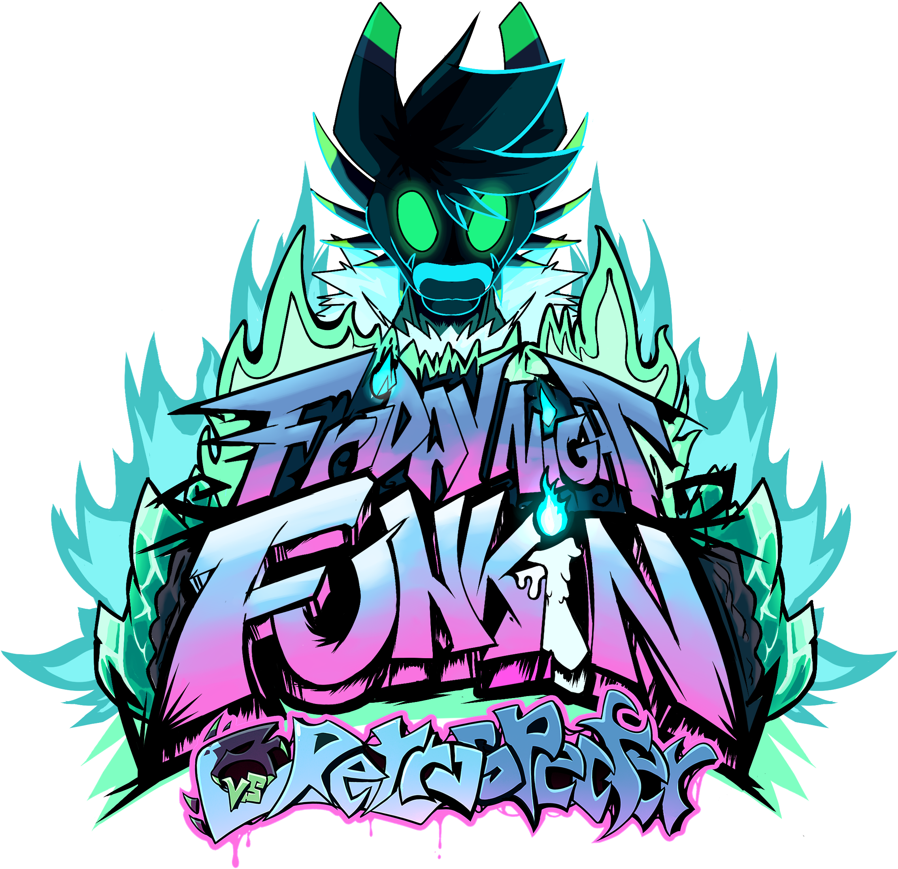

# Friday Night Funkin': Vs Retrospecter
## Friday Night Funkin'
**Friday Night Funkin'** is a rhythm game originally made for Ludum Dare 47 "Stuck In a Loop".

Links: **[itch.io page](https://ninja-muffin24.itch.io/funkin) ⋅ [Newgrounds](https://www.newgrounds.com/portal/view/770371) ⋅ [source code on GitHub](https://github.com/ninjamuffin99/Funkin)**
> Uh oh! Your tryin to kiss ur hot girlfriend, but her MEAN and EVIL dad is trying to KILL you! He's an ex-rockstar, the only way to get to his heart? The power of music... 

## Vs Retrospecter
**Vs Retrospecter** is a mod for Friday Night Funkin' featuring Retrospecter, a character made by [Retrospecter](https://twitter.com/RetroSpecter_).  
The mod was built using **[Kade Engine](https://github.com/KadeDev/Kade-Engine)**.

**[GameBanana mod page](https://gamebanana.com/mods/317366)**

# Credits
### Friday Night Funkin'
 - [ninjamuffin99](https://twitter.com/ninja_muffin99) - Programming
 - [PhantomArcade3K](https://twitter.com/phantomarcade3k) and [Evilsk8r](https://twitter.com/evilsk8r) - Art
 - [Kawai Sprite](https://twitter.com/kawaisprite) - Music

This game was made with love to Newgrounds and its community. Extra love to Tom Fulp.

### Vs Retrospecter
- [Retrospecter](https://twitter.com/RetroSpecter_) - Director and Audio Designer
- [Andrew J.](https://twitter.com/andrewmjart) - Sprite Artist/Animator
- [Arcy](https://twitter.com/AwkwardArcy) - Programmer
- [AyeTSG](https://twitter.com/AyeTSG) - Programmer
- [Blue](https://twitter.com/bluetealover1) - Sprite Artist
- [BonesTheSkelebunny01](https://twitter.com/BSkelebunny01) - Concept Artist
- [Carbon](https://twitter.com/lucaslacus02) - Programmer
- [Clipee](https://twitter.com/LilyClipster) - Charting
- [Crudaka](https://twitter.com/Croodaka) - Loading Screen Art
- [Dax](https://twitter.com/Daxite_) - Concept/Sprite Artist
- [D6](https://twitter.com/DSiiiiiix) - Sprite/UI Artist
- [Iago](https://twitter.com/IagoAnims) - Early Concept/Sprite Artist
- [Jade](https://twitter.com/aureumber) - Pixel Artist
- [Kamex](https://twitter.com/kamexvgm) - Audio Designer
- Kevin B. - Logo Artist
- [Kinix](https://twitter.com/SLKinix) - Video Footage
- [KittenSneeze](https://twitter.com/thekittensneeze) - Sprite Artist/Animator
- [Pyxl](https://twitter.com/pyxlbird) - Sprite Artist
- [Ravi](https://twitter.com/RavioliBox) - Early Sprite Artist
- [Razur](https://twitter.com/razur_draws) - Background Artist
- [RobynTheDragon](https://twitter.com/RobynTheDragonn) - Promotional Art
- [Shiba Chichi](https://twitter.com/lolychichi) - Sprite Artist
- [Snow](https://twitter.com/snowthefox122) - Charting/Modcharting
- [Speck](https://twitter.com/speckygb) - Sprite Animator
- [Springy_4264](https://twitter.com/Springy_4264) - Sprite Artist/Animator (Ace Boyfriend)
- [Tenzu](https://twitter.com/Tenzubushi) - FX Artist/Animator
- [Wildface](https://twitter.com/wildface1010) - Icon Artist and Sprite Animator
- [WolfWrathKnight](https://twitter.com/wolfwrathknight) - Sprite Artist/Animator

### Kade Engine
- [KadeDeveloper](https://twitter.com/KadeDeveloper) - Maintainer and lead programmer
- [The contributors](https://github.com/KadeDev/Kade-Engine/graphs/contributors)